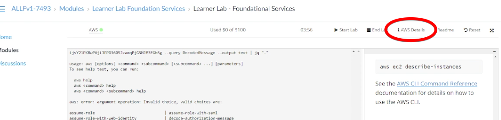

# Learning outcome


By the end of this lesson, you are able to

* Setup a Multi-node Hadoop cluster (and Spark cluster)
* Manage HDFS using Command Line Interface
* Execute Simple MapReduce Job
* Design and implement mapreduce job


# Prelude - Please attempt this before the lab


Since we are using AWS EC2, setting up a hadoop cluster is pretty straight forward. 

We are going to rely on an open source project `Flintrock` which aims to automate the setup of 
a Spark cluster. Since in most of the use cases, Spark requires a distributed data storage, Flinkrock supports
HDFS out of the box.

**I recommend you watch the video tutorial of how to set up a cluster on EC2 with flintrock.** This text guide can serve as an additional reference. If you watch the video on eDimension, you may skip to Step 4. 

If you have any issues with Flintrock, you may also proceed to use the AMI image that was provided (see last section `Alternative AMI Image Install without Flintrock`). If you follow these instructions you can skip steps 1-4. 

## Step 1: Preparation

Assume that we have already setup an AWS IAM user with an access key and an access secret. 
If the user has not been created, create one by recalling the steps from Lab 1, `boto3` exercise. Don't forget to chmod 400 it. 

If you are using AWS educate account you should be able to find the IAM access id and secret here



We also need to have a client machine which is running Linux or Mac OS X. 
If Windows is the only installed OS, we can try to install a Windows Linux Subsystem or a VM.

Make sure `boto3` is installed.

## Step 2: Setup


1. Launch a bash / zsh terminal and install flintrock

```bash
$ sudo pip3 install flintrock
```
when the installation completes, type 

```bash
$ flintrock

Usage: flintrock [OPTIONS] COMMAND [ARGS]...

  Flintrock

  A command-line tool for launching Apache Spark clusters.

Options:
  --config TEXT         Path to a Flintrock configuration file.
  --provider [ec2]
  --version             Show the version and exit.
  --debug / --no-debug  Show debug information.
  --help                Show this message and exit.

Commands:
  add-slaves     Add slaves to an existing cluster.
  configure      Configure Flintrock's defaults.
  copy-file      Copy a local file up to a cluster.
  describe       Describe an existing cluster.
  destroy        Destroy a cluster.
  launch         Launch a new cluster.
  login          Login to the master of an existing cluster.
  remove-slaves  Remove slaves from an existing cluster.
  run-command    Run a shell command on a cluster.
  start          Start an existing, stopped cluster.
  stop           Stop an existing, running cluster.

```

2. Initialize the Flintrock configuration file

```bash
$ flintrock configure
```

A configuration file `~/.config/flintrock/config.yaml` is generated. 

3. Open the `config.yaml` file with a text editor and update the content similar 
to the following. Note that the key refers to your original key that you created earlier on in this course. 

```yaml
services:
  spark:
    version: 3.1.2
    download-source: "https://archive.apache.org/dist/spark/spark-3.1.2/"
  hdfs:
    version: 3.2.0
    download-source: "https://archive.apache.org/dist/hadoop/common/hadoop-3.2.0/"

provider: ec2

providers:
  ec2:
    key-name: <the_pem_key_name_you_used_when_creating_pem_file>
    identity-file: <path_to_your_pem_file.pem>
    # key-name: do_key
    # identity-file: /home/do_key.pem
    instance-type: t2.medium
    # instance-type: m5.large
    region: us-east-1
    # availability-zone: <name>
    ami: ami-02f624c08a83ca16f # Amazon Linux 2 5.10
    user: ec2-user
    tenancy: default  # default | dedicated
    ebs-optimized: no  # yes | no
    instance-initiated-shutdown-behavior: terminate  # terminate | stop

launch:
  num-slaves: 3
  install-hdfs: true
  install-spark: true
  java-version: 8

debug: true

```

4. Export the AWS IAM key id and secret as environment variables, or directly edit the file `~/.aws/credentials`, and copy paste the session information from your aws lab (see video). 

```bash 
$ export AWS_ACCESS_KEY_ID=<YOUR_KEY_ID>
$ export AWS_SECRET_ACCESS_KEY=<YOUR_ACCESS_KEY>

```

## Step 3: Launch the cluster

1. Launch the cluster 

```bash 
$ flintrock launch my_test_cluster

```
We should see something similar to the following: 

```bash
2021-06-29 10:23:24,074 - flintrock.ec2       - INFO  - Launching 4 instances...
2021-06-29 10:23:36,628 - flintrock.ec2       - DEBUG - 4 instances not in state 'running': 'i-0945e74dada74d6fe', 'i-04203f2cc9024658a', 'i-0c1a00af39d307d72', ...
2021-06-29 10:23:39,781 - flintrock.ec2       - DEBUG - 4 instances not in state 'running': 'i-0945e74dada74d6fe', 'i-0c1a00af39d307d72', 'i-04203f2cc9024658a', ...
2021-06-29 10:23:42,883 - flintrock.ec2       - DEBUG - 3 instances not in state 'running': 'i-0945e74dada74d6fe', 'i-0c1a00af39d307d72', 'i-0dcf4482176f3230f', ...
2021-06-29 10:23:45,954 - flintrock.ec2       - DEBUG - 3 instances not in state 'running': 'i-0945e74dada74d6fe', 'i-0c1a00af39d307d72', 'i-0dcf4482176f3230f', ...
2021-06-29 10:23:49,062 - flintrock.ec2       - DEBUG - 1 instances not in state 'running': 'i-0945e74dada74d6fe', ...
2021-06-29 10:23:52,731 - flintrock.ssh       - DEBUG - [13.212.89.251] SSH exception: [Errno None] Unable to connect to port 22 on 13.212.89.251
2021-06-29 10:23:55,727 - flintrock.ssh       - DEBUG - [13.250.65.255] SSH timeout.
2021-06-29 10:23:55,731 - flintrock.ssh       - DEBUG - [13.212.245.73] SSH timeout.
2021-06-29 10:23:55,731 - flintrock.ssh       - DEBUG - [52.77.217.139] SSH timeout.
2021-06-29 10:23:58,208 - flintrock.ssh       - INFO  - [13.212.89.251] SSH online.
2021-06-29 10:23:58,513 - flintrock.core      - INFO  - [13.212.89.251] Configuring ephemeral storage...
2021-06-29 10:24:00,860 - flintrock.ssh       - DEBUG - [52.77.217.139] SSH exception: [Errno None] Unable to connect to port 22 on 52.77.217.139
2021-06-29 10:24:01,178 - flintrock.ssh       - INFO  - [13.212.245.73] SSH online.
2021-06-29 10:24:01,444 - flintrock.ssh       - INFO  - [13.250.65.255] SSH online.
2021-06-29 10:24:01,476 - flintrock.core      - INFO  - [13.212.245.73] Configuring ephemeral storage...
2021-06-29 10:24:01,812 - flintrock.core      - INFO  - [13.250.65.255] Configuring ephemeral storage...
2021-06-29 10:24:07,219 - flintrock.ssh       - INFO  - [52.77.217.139] SSH online.
2021-06-29 10:24:07,504 - flintrock.core      - INFO  - [52.77.217.139] Configuring ephemeral storage...
2021-06-29 10:24:10,991 - flintrock.core      - INFO  - [13.212.89.251] Installing AdoptOpenJDK Java 8...
2021-06-29 10:24:14,126 - flintrock.core      - INFO  - [13.250.65.255] Installing AdoptOpenJDK Java 8...
2021-06-29 10:24:17,606 - flintrock.core      - INFO  - [13.212.245.73] Installing AdoptOpenJDK Java 8...
2021-06-29 10:24:17,848 - flintrock.core      - INFO  - [52.77.217.139] Installing AdoptOpenJDK Java 8...
2021-06-29 10:24:45,125 - flintrock.services  - INFO  - [13.212.89.251] Installing HDFS...
2021-06-29 10:24:45,227 - flintrock.services  - DEBUG - [13.212.89.251] Downloading Hadoop from: https://archive.apache.org/dist/hadoop/common/hadoop-3.2.0/hadoop-3.2.0.tar.gz
2021-06-29 10:24:50,611 - flintrock.services  - INFO  - [13.250.65.255] Installing HDFS...
2021-06-29 10:24:50,702 - flintrock.services  - DEBUG - [13.250.65.255] Downloading Hadoop from: https://archive.apache.org/dist/hadoop/common/hadoop-3.2.0/hadoop-3.2.0.tar.gz
2021-06-29 10:24:54,621 - flintrock.services  - INFO  - [13.212.245.73] Installing HDFS...
2021-06-29 10:24:54,743 - flintrock.services  - DEBUG - [13.212.245.73] Downloading Hadoop from: https://archive.apache.org/dist/hadoop/common/hadoop-3.2.0/hadoop-3.2.0.tar.gz
2021-06-29 10:24:56,392 - flintrock.services  - INFO  - [52.77.217.139] Installing HDFS...
2021-06-29 10:24:56,488 - flintrock.services  - DEBUG - [52.77.217.139] Downloading Hadoop from: https://archive.apache.org/dist/hadoop/common/hadoop-3.2.0/hadoop-3.2.0.tar.gz
2021-06-29 10:25:44,608 - flintrock.services  - INFO  - [13.212.89.251] Installing Spark...
2021-06-29 10:25:44,720 - flintrock.services  - DEBUG - [13.212.89.251] Downloading Spark from: https://archive.apache.org/dist/spark/spark-3.1.2/spark-3.1.2-bin-hadoop3.2.tgz
2021-06-29 10:25:53,303 - flintrock.services  - INFO  - [13.250.65.255] Installing Spark...
2021-06-29 10:25:53,420 - flintrock.services  - DEBUG - [13.250.65.255] Downloading Spark from: https://archive.apache.org/dist/spark/spark-3.1.2/spark-3.1.2-bin-hadoop3.2.tgz
2021-06-29 10:25:54,856 - flintrock.services  - INFO  - [13.212.245.73] Installing Spark...
2021-06-29 10:25:54,966 - flintrock.services  - DEBUG - [13.212.245.73] Downloading Spark from: https://archive.apache.org/dist/spark/spark-3.1.2/spark-3.1.2-bin-hadoop3.2.tgz
2021-06-29 10:25:58,834 - flintrock.services  - INFO  - [52.77.217.139] Installing Spark...
2021-06-29 10:25:58,942 - flintrock.services  - DEBUG - [52.77.217.139] Downloading Spark from: https://archive.apache.org/dist/spark/spark-3.1.2/spark-3.1.2-bin-hadoop3.2.tgz
2021-06-29 10:26:36,881 - flintrock.services  - INFO  - [52.77.217.139] Configuring HDFS master...
2021-06-29 10:27:01,910 - flintrock.services  - INFO  - [52.77.217.139] Configuring Spark master...
2021-06-29 10:27:11,842 - flintrock.services  - INFO  - HDFS online.
2021-06-29 10:27:12,049 - flintrock.services  - INFO  - Spark online.
2021-06-29 10:27:12,053 - flintrock.ec2       - INFO  - launch finished in 0:03:55.
Cluster master: ec2-52-77-217-139.ap-southeast-1.compute.amazonaws.com
Login with: flintrock login test_cluster
```

If you have any issues, make sure all dependencies are installed, your credentials are working (they refresh often), and you double check the video on eDimension so you don't skip any steps. 

You only have to run launch one time to install the cluster. To log in, you just use the instructions in Step 4 below. 


## Step 4: Test drive the cluster

1. Login to the cluster
```bash
$ flintrock login <your_cluster_name>
```

We should see 

```bash
Warning: Permanently added '52.77.217.139' (ECDSA) to the list of known hosts.
Last login: Tue Jun 29 02:27:01 2021 from 66.96.210.124

       __|  __|_  )
       _|  (     /   Amazon Linux 2 AMI
      ___|\___|___|

https://aws.amazon.com/amazon-linux-2/
29 package(s) needed for security, out of 38 available
Run "sudo yum update" to apply all updates.
[ec2-user@ip-172-31-41-151 ~]$ 
```

Alternatively, you can directly ssh into the master node, whose IP address you can find in the Amazon EC2 instances panel. 


## Trouble Shooting

1. We encounter the following error

```
Flintrock could not find your AWS credentials. You can fix this by providing your credentials via environment variables or by creating a shared credentials file.
```
when launching the cluster

Make sure the ACCESS KEY and SECRET are exported as environment variables.

2. We encounter the following error when launching the cluster

```bash
error:
    raise Exception("HDFS health check failed.") from e
Exception: HDFS health check failed.
```

Edit the config.yaml to use Java 8

IF the Java version has already been set to 8. Try to destroy the cluster and launch again.


## High level of Architecture of Hadoop

Recall that Hadoop consists of the following three major components

* MapReduce - Data Processing Layer
* Hadoop Distributed File System - Data Storage Layer
* Yarn - Resource Management Layer


## HDFS


Recall the HDFS architecture

{width=100%}

* A Master-worker architecture
* Block Size (default 64MB v1, 128MB v2+)
* Each block is replicated (Recommended 3 or any odd number > 3)
* Name node maps filename/path to block IDs
* Client fetches actual data using the block IDs


## HDFS dfs operations

* File uploading
```bash
hdfs dfs -put <local_file_path> <hdfs_file_path>
```

Note that the file path in hdfs must be a full path.

* File downloading
```bash
hdfs dfs -get <hdfs_file_path> <local_file_path>
```

* File listing
```bash
hdfs dfs -ls [optios] <hdfs_file_path>
```

* File deleting

```bash
hdfs dfs -rm [optios] <hdfs_file_path>
```


* File copying

```bash
hdfs dfs -cp [optios] <src_hdfs_file_path> <target_hdfs_file_path>
```

* File moving/renaming

```bash
hdfs dfs -mv [optios] <src_hdfs_file_path> <target_hdfs_file_path>
```

* For more hdfs dfs commands, try `hdfs dfs`. You may realize many HDFS dfs sub commands are *borrowed* from Linux bash.


## HDFS namenode operations

* Namenode format (for setting up only)

```bash
hdfs namenode -format
```

## HDFS admin operations


* Admin report 

```bash
hdfs dfsadmin -report 
```

* Safemode - the name node is in read-only mode.
   * If your cluster (in particular namenode) crashes, its next startup might be stuck in safe mode.
   * to check 
   ```bash
   hdfs dfsadmin -safemode get
   ```
   * to manually exit safemode
   ```bash
   hdfs dfsadmin -safemode leave
   ```
   
* For more hdfs admin, try `hdfs dfsadmin`
   


## Prelude Exercise 

Assuming we have launch the hadoop cluster using FlintRock


1. clone the lab work repo from github (if git is not installed, install it by issuing `sudo yum install git`)
```bash
$ mkdir -p ~/git
$ cd ~/git
$ git clone https://github.com/sutd50043/cohortclass/ 
```

2. transfer the file in `~/git/cohortclass/cc10/data/TheCompleteSherlockHolmes.txt` to the folder `/input/` in HDFS.

After the transfer, you should find the file `TheCompleteSherlockHolmes.txt` in the HDFS folder `/input/`.


3. test your cluster with the following map reduce job.

```bash
$ hadoop jar /home/ec2-user/hadoop/share/hadoop/mapreduce/hadoop-mapreduce-examples-3.2.0.jar \
wordcount /input /output
```
Note: you might need to make sure that the output folder DOES NOT exist before the execution of the above command.

Note: If you are using the AMI image to run hadoop and not Flintrock (as described at the end of this file), the examples file is located at `/opt/hadoop-3.3.0/share/hadoop/mapreduce/hadoop-mapreduce-examples-3.3.0.jar`

4. transfer the result from the folder `/output/` in hdfs back to the linux file system.


## Shutdown the session

To safely terminate your cluster, on the master node, run: 

```bash
/home/ec2-user/hadoop/sbin/stop-all.sh
/home/ec2-user/spark/sbin/stop-all.sh
```

Then type `exit` to log out of the flintrock session/ssh. 


## End of Prelude: Terminate the cluster (Do it when you need to)

Back to our client machine.

```bash
$ flintrock destroy <your_cluster_name>

```

Note that you will lose everything you installed on the cluster. 


# Start with the Toy MapReduce library (LOCAL)

**You can exit the cluster for now and run the following exercises on your local machine or Google Colab.**

During the lecture, we developed a toy MapReduce library in Python. It is sometimes useful to design 
Map Reduce jobs in this toy library before diving into the specific implementation such as 
Hadoop MapReduce or Spark. 

Recall that `map` and `reduce` are the two basic combinators/functions that enable data parallelism.

Leveraging the two combinators, we built the following combinators

* `filter`
* `flatMap`
* `shuffle`
* `reduceByKey` and `reduceByKey2`


## Exercise 1:

The first four exercises are run locally on your machine using the toy library. 


Define `min()` and `max()` using `reduce()`. 

Sample test cases

```python
>>> import ex1
>>> min([32,63,7,10, 100])
7
>>> max([32,63,7,10, 100])
100
```


## Exercise 2: 

Suppose you have a big data set (many terabytes) with many records of the following form:
`(productID, supplierID, price)`
where `productID` identifies a unique product,  `supplierID` identifies a unique supplier, and price is the sale price. 
You want a list of suppliers, listing for each supplier the average sale price of all items by the supplier. 
Write a MapReduce job for this task using the toy MapReduce library.

You may find the toy MapReduce library `mapreduce.py` in `~/git/cohortclass/cc10/ex2/` with some example code
`wordcount.py`.

Complete the following: 


```python
from mapreduce import *

def read_db(filename):
    db = []
    with open(filename, 'r') as f:
        for l in f:
            db.append(l)
    f.close()
    return db
            
test_db = read_db("./data/price.csv")

# TODO: FIXME
# the result should contain a list of suppliers, 
# with the average sale price for all items by this supplier.
result = []

# print the results
for supplier,avg_price in result:
    print(supplier, avg_price)
```

It's ok if you can't start straight from the toy MapReduce library.
In that case you may want to start with a version using for loops and 
dictionaries. Then from there you can start to replace loops with map,
reduce and other combinators found in the toy MapReduce library.


## Relational Algebra and MapReduce

Recall that in Lecture 2, we learned about Relational Algebra in the
context of RDBMS. Assuming that we are dealing with tabular (CSV / TSV) data in
HDFS and we stick to bag semantics instead of set semantics, can we
implement a subset of Relational Algebra using MapReduce?

As a POC, we can use the toy MapReduce library as our MapReduce
framework and the product-supplier-price dataset in Exercise 2 as the data.

```python
test_db = read_db("./data/price.csv")
priceTable = map(lambda ln:ln.strip().split(','),test_db)
```

* Projection $\Pi_{supplierID}(priceTable)$, can be implemented as

```python
def supplierID(cols): return cols[1]
map(supplierID, priceTable)
```

* Selection $\sigma_{price>100}(priceTable)$, can be implemented as

```python
def price(cols):return cols[2]
filter(lambda x:price(x) > 100, priceTable)
```

* Aggregation $\gamma^{supplierID}_{avg(price)}(priceTable)$, we have done it
  in exercise 2.

* What about the join $\Join$? Suppose we have another CSV dataset `stockTable` with
schema "productID, stockLevel", can we implement `priceTable`
$\Join_{productID}$ `stockTable`? 

### Exercise 3: 

Assuming that we have enough memory to accomodate one table in the RAM, implement the join operation
using the toy MapReduce library.


## Exercise 4: non-linear structures

The concept of `map` and `reduce` is applicable even to non-linear
data structure.

### Ex 4.1 Binary Tree Data 

Given the following data structure

```python
class Tree:
    def __init__(self,value,left=None,right=None):
        self.value = value
        self.left = left
        self.right = right
    def __str__(self):
        return "{value:%s, left:%s, right:%s}" % 
		(str(self.value), str(self.left), str(self.right))
    
mytree = Tree(17, Tree(11, Tree(4), Tree(13)), Tree(5, None, Tree(30)))
```

```python
>>> str(mytree)
'{value:17, left:{value:11, left:{value:4, left:None, right:None}, 
 right:{value:13, left:None, right:None}}, right:{value:5, left:None, 
 right:{value:30, left:None, right:None}}}'
```

* Define a `tmap(f,t)` which applies `f` to all `value` elements in tree
`t`. e.g.

```python
>>> str(tmap(lambda x: x + 1, mytree))
'{value:18, left:{value:12, left:{value:5, left:None, right:None},
 right:{value:14, left:None, right:None}}, right:{value:6, left:None, 
 right:{value:31, left:None, right:None}}}'
```

* Define a `treduce(f,t,acc)` which aggregates all `value` elements in
  tree `t` with a binary function `f` and `acc` as the (initial)
  accumulator, e.g.

```python
>>> treduce(lambda x,y:x + y, mytree, 0)
80
```


### Ex 4.2 List of List Data


Given the following data

```python

myllist = [ ["one", "two", "two", "three", "three", "three"], 
           ["four", "four", "four", "four", "five"], 
		   ["five", "five", "five", "five"] ]
```

* Define a `llmap(f,ll)` function which applies `f` to all elements in the list of lists. e.g.

```python
>>> ll1 = llmap(lambda w:1, myllist)
>>> ll1
[[1, 1, 1, 1, 1, 1], [1, 1, 1, 1, 1], [1, 1, 1, 1]]
```

* Define a `llreduce(f, ll, acc)` function which applies `f` to aggregate all alements in the list of lists `ll`, e.g.

```python
>>> llreduce(lambda x,y: x + y, ll1, 0)
15
```


# Hadoop JVM API (on Flintrock cluster)

Hadoop's JVM API is the native API. It offers

* Better performance
* Better debugging info
* Compiler and Type checking

## Wordcount 
The Hadoop MapReduce WordCount job is decribed as follows in JVM API

```java
import java.io.IOException;
import java.util.StringTokenizer;

import org.apache.hadoop.conf.Configuration;
import org.apache.hadoop.fs.Path;
import org.apache.hadoop.io.IntWritable;
import org.apache.hadoop.io.Text;
import org.apache.hadoop.mapreduce.Job;
import org.apache.hadoop.mapreduce.Mapper;
import org.apache.hadoop.mapreduce.Reducer;
import org.apache.hadoop.mapreduce.lib.input.FileInputFormat;
import org.apache.hadoop.mapreduce.lib.output.FileOutputFormat;

public class WordCount {

  public static class TokenizerMapper
       extends Mapper<Object, Text, Text, IntWritable>{

    private final static IntWritable one = new IntWritable(1);
    private Text word = new Text();

    public void map(Object key, Text value, Context context
                    ) throws IOException, InterruptedException {
      StringTokenizer itr = new StringTokenizer(value.toString());
      while (itr.hasMoreTokens()) {
        word.set(itr.nextToken());
        context.write(word, one);
      }
    }
  }

  public static class IntSumReducer
       extends Reducer<Text,IntWritable,Text,IntWritable> {
    private IntWritable result = new IntWritable();

    public void reduce(Text key, Iterable<IntWritable> values,
                       Context context
                       ) throws IOException, InterruptedException {
      int sum = 0;
      for (IntWritable val : values) {
        sum += val.get();
      }
      result.set(sum);
      context.write(key, result);
    }
  }

  public static void main(String[] args) throws Exception {
    Configuration conf = new Configuration();
    Job job = Job.getInstance(conf, "word count");
    job.setJarByClass(WordCount.class);
    job.setMapperClass(TokenizerMapper.class);
    job.setCombinerClass(IntSumReducer.class);
    job.setReducerClass(IntSumReducer.class);
    job.setOutputKeyClass(Text.class);
    job.setOutputValueClass(IntWritable.class);
    FileInputFormat.addInputPath(job, new Path(args[0]));
    FileOutputFormat.setOutputPath(job, new Path(args[1]));
    System.exit(job.waitForCompletion(true) ? 0 : 1);
  }
}
```

In the above example, the `WordCount` class contains two inner
classes, `TokenizedMapper` and `IntSumReducer`.  The former describes
the mapper task and the latter defines the reducer task.

`TokenizedMapper` extends the base class `Mapper<Object, Text, Text,
IntWritable>`. The type paraemters denote the types of the input key,
input value, output key and output value respectively. `Text` is a
serializable version of `String`. `IntWritable` is a serializable
version of `Int`. Similar observation applies to the `IntSumReducer`.

In the `main` method, we create a job instance by reading the
configuration from the current hadoop cluster. We specify the mapper
and the reducer classes as well as the input and output format.


## Exercise 5

Build and run WordCount job in JVM API.

Assuming we have some data in the HDFS folder `/input/`

We first install gradle (the Java project manager) via SDKMan


```bash
$ curl -s "https://get.sdkman.io" | bash
$ source "$HOME/.sdkman/bin/sdkman-init.sh"
$ sdk install gradle 4.4.1
```
Note: if you are using the AMI image, you can use `apt-get` to install gradle instead of `skman`: `sudo apt-get install gradle`, the instructions below remain the same. 

Gradle needs more memory to run. Let's create a swapfile for it.

```bash
$ sudo dd if=/dev/zero of=/swapfile bs=1M count=2048
$ sudo mkswap /swapfile
$ sudo chmod 600 /swapfile
$ sudo swapon /swapfile

```


```bash
$ cd ~/git/cohortclass/cc10/ex5
$ gradle jar
$ hadoop jar build/libs/ex5.jar com.sutd50043.WordCount /input /output
```

Now rewrite the answer from exercise 2 using Java and run it in Hadoop.

Dont't forget to shutdown your hadoop cluster before shutting the VM.


# Alternative AMI Image Install without Flintrock

For those of you who have trouble launching the cluster with Flintrock, we provide an AMI image with a single node that has Hadoop and Spark. 

Image info: **AMIID: ami-0ed5085c72555f350**

This needs to run on instance type: t2-medium (or up)

## Setting up the image

In the EC2 dashboard you can go to Images -> AMIs on the left hand side. In the search box, search for `ami-0ed5085c72555f350`. 

Now you can check the sutd50043-hadoop-ubuntu image that appeared and clikc the yellow button `Launch instance from AMI`. 

Be sure to select at least a t2-medium instance size, and add your key pair for ssh access, and create your instance. 


## Usage

Now you can ssh into your new instace as a user `ubuntu`. Your ssh command will look something like this (do replace with your own url/IP), which can be found in the EC2 dashboard: 

```bash
$ ssh -i "yourkey.pem" ubuntu@ec2-54-210-2-174.compute-1.amazonaws.com
```

First relogin as user hadoop:

```bash
$ sudo su - hadoop
```
Start hadoop: 
```bash
$ /opt/hadoop-3.3.0/sbin/start-dfs.sh && /opt/hadoop-3.3.0/sbin/start-yarn.sh
```

Start spark: 
```bash
$ /opt/spark-3.1.2-bin-hadoop3.2/sbin/start-all.sh
```

You can test that your server is running well: 
```bash
$ hdfs dfsadmin -report
```

# Shutdown

Don't forget to shut down your hadoop before shutting down your image. 

```bash
$ /opt/spark-3.1.2-bin-hadoop3.2/sbin/stop-all.sh
$ /opt/hadoop-3.3.0/sbin/stop-yarn.sh && /opt/hadoop-3.3.0/sbin/stop-dfs.sh
```
