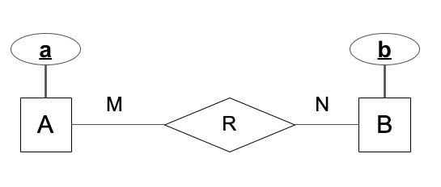
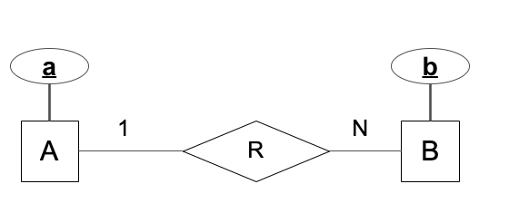

# 50.043 Cohort class 2

## Learning Outcomes

By this end of this cohort class you should be able to 

1. Convert an ER model into a relational model
1. Use relational algebra to query a relational model

## Recap Relational Model 

Relational model is an instance of a logical model. It describes how data are stored and queried (manipulated). 

Relational Model defines data in `Relation`. 

1. Each `Relation` is an unordered **set** containing relationship of attributes. Attributes in Relational Model are sometimes referred to as *fields*.
2. Note that we should not confuse them with the relationship and attributes mentioned in ER model. 
    * Relational model is a logical model, describing how data are stored and queried. ER model is a conceptual model, describing what data the application have / need.
    * `Relation` in Relational model is mathmatical relation, while the relationship in ER model is the connection in business domain. 
3. `Relation` is an set of `Tuple`s. Each `Tuple` is a sequence of attribute values in the `Relation`. 

For instance

|Student Number|Name | Email | DoB|
|---|---|---|---|
|1234|James|james@istd|1/1/2000|
|5678|Vansesa|vanessa@epd|2/4/1999|
|3093|David|david@esd|3/7/2000|

The above table is an instance of a `Relation`, of student profile.
* The first row in the *Schema* of the `Relation`. The second rows onwards are tuples. 
* Each column defines an attribute (or a field).

The above relation have the following schema 
$StudentProfile(StudentName : Integer, Name:String, Email:String, DoB:Date)$

## Exercise 3
(Ah yes, we are starting from exercise 3, because I moved exercises 1 and 2 to CC1. =] )

Translate this to relational model

## Exercise 4

Translate this to relational model

## Recap Relational Algebra

Relationa algebra defines a set of operators that manipulate data in a relation.

1. A selection operator, $\sigma_{P}(R)$, takes a logical predicate $P$ and a relation $R$ and returns all the tuple in $R$ that satisfy $P$. 
2. A projection operator $\Pi_{A_1,A_2,...}(R)$, takes a set of attribute names $A_1,...,A_n$ and a relation $R$, and returns a relation that contains the data of columns $A_1,...,A_n$ in $R$.
3. An intersection operation  $R \cap S$ finds all common tuples from $R$ and $S$, assuming $R$ and $S$ sharing a common schema.
4. A union operation $R \cup S$ returns a relation containing all tuples from $R$ and all thetuples from $S$, assuming $R$ and $S$ sharing a common schema.
5. A difference operation $R - S$ returns a relation containing all tuples from $R$ that are not in $S$, assuming $R$ and $S$ sharing a common schema.
6. A cartesian product operation $R \times S$ returns a relation containing all possible combination of some tuple from $R$ and some tuple from $S$. (Note that $R$ and $S$ might have different schema.)
7. The inner join operator $(R \bowtie_{R.A = S.B, R.C=S.D,...} S)$, returns a relation that containing tuples from $R\times S$ that satisfy $R.A = S.B, R.C=S.D,...$.
8. The natural join operator $(R \bowtie S)$, returns a relation that containing tuples from $R\times S$ that satisfy $R.A = S.A, R.B=S.B,...$, where $A$, $B$, ... are the common attributes between $R$ and $S$.
9. Right outer join $R ⟖_{R.A=S.B} S$ produces a relation containing all entries from the inner join and all the remaining tupel from $S$ which we could not find a match from $R$, whose attributes will be filled up with NULL. Likewise for Left outer join.
10. Renaming operation $\rho_{R'(A_1,...,A_n)}(R)$ produces a new relation $R'(A_1,...,A_n)$ containing all tuples from $R$, assuming the $S_R$ and $S_{R'}$ share the same types.
11. Aggregation operation $_{A_1,...,A_n} \gamma_{F_1(B_1),F_2(B_2),...} (R)$ produces a new relation $R'$ which contains
    * $A_1,...,A_n$ as the attribute names to group by
    * $F_1(B_1)$,...,$F_m(B_m)$ as the aggregated values 
    where
    * $F_1, ..., F_m$ are aggregation functions such as `SUM()`, `AVG()`, `MIN()`, `MAX()`, `COUNT()`.
    * $A_1, ..., A_n$, $B_1, ..., B_m$ are attributes from $R$.

## Exercise 5

Given the following relation which records the results of running competition at the Olympic​

Run(<ins>Name, Distance</ins>, Time)​​

Give an expression in relational algebra that finds all runners who:​

1. Take part in 100m category.​
2. Only take part in 100m category​

## Exercise 6

Given the following relations modelling a library. A book in a library may have multiple copies. ​

Reader (<ins>ReaderID</ins>, FirstName, LastName)​

Book (<ins>ISBN</ins>, Title, Author, PublicationDate, PublisherName)​

Publisher (<ins>PublisherName</ins>, PublisherCity)​

Copy(<ins>ISBN, CopyID</ins>, ShelfLocation)​

Loan (<ins>ReaderID, ISBN, CopyID</ins>, ReturnDate)​

Find names of readers who borrow more than 10 copies of a book.​

## Exercise 7

Using the same relational model as Exercise 6, find title and author of book from publisher in London or New York.​

## Exercise 8

Using the same relational model as Exercise 6, find title and author of books that Kenny Lu borrowed​.

## Exercise 9 

Using the same relational model as Exercise 6, find ​name of users who borrowed at least two different books​.

