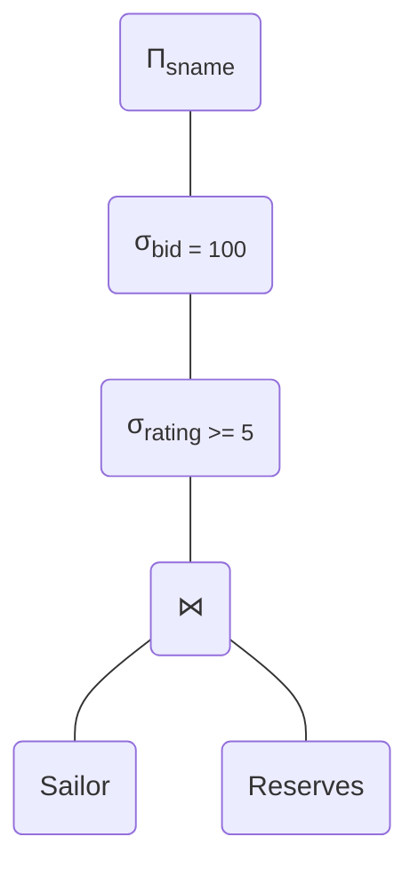
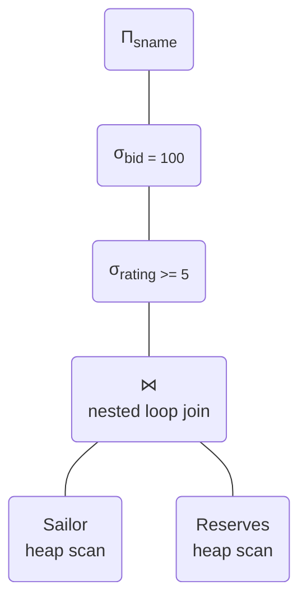
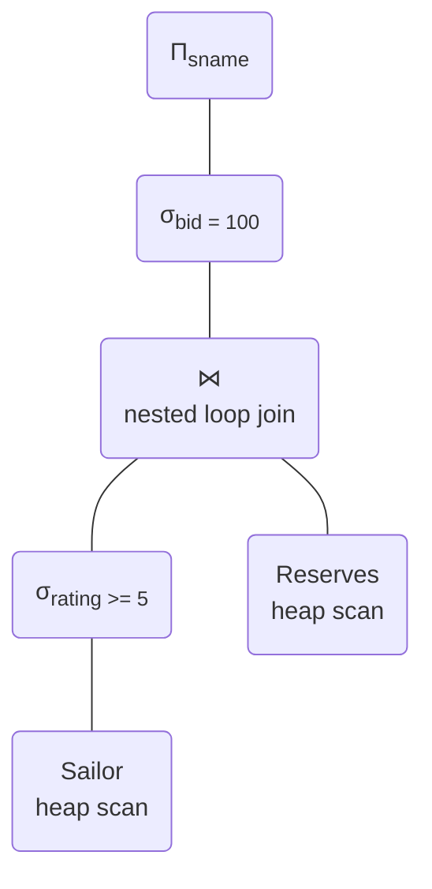
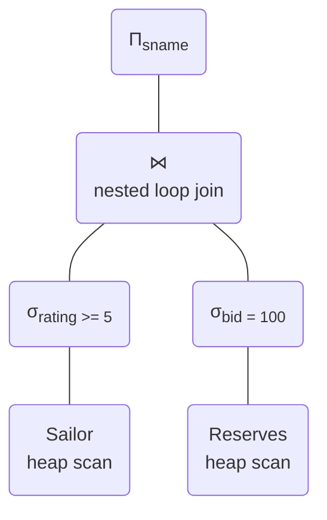
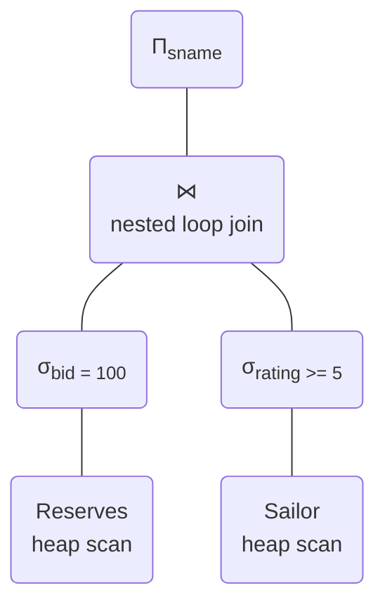
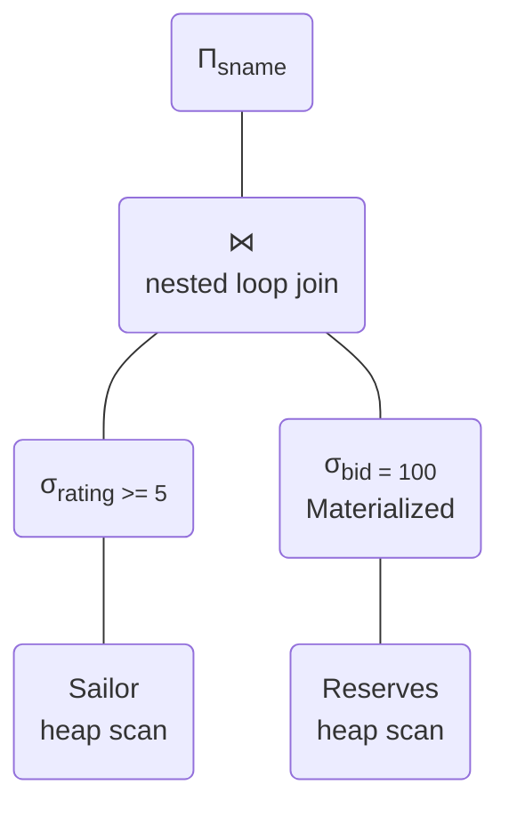
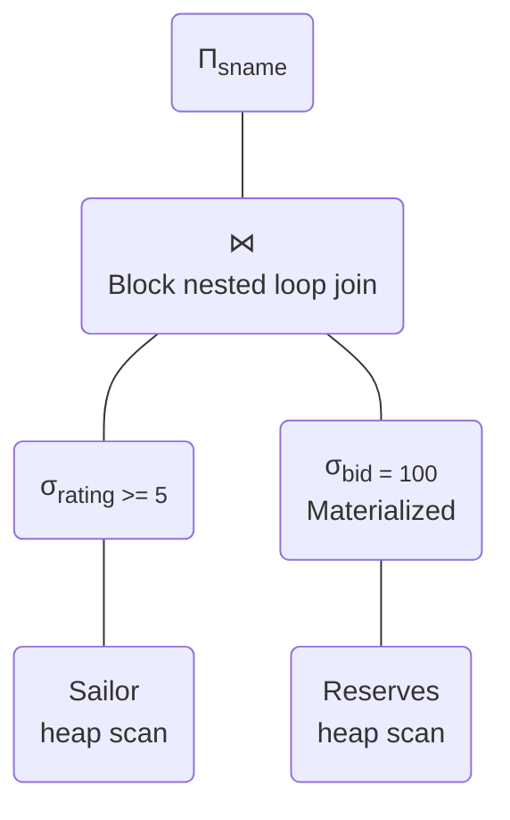
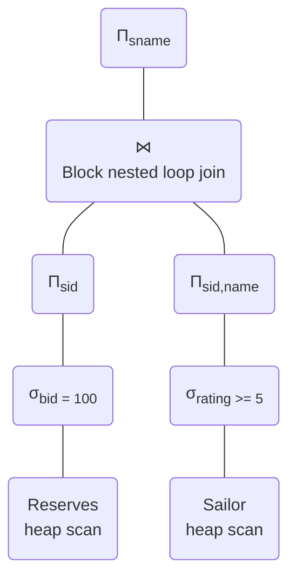
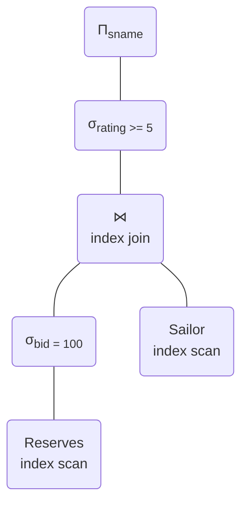

# 50.043 Query Optimization

## Learning Outocmes

By the end of this class, you should be able to

1. apply relational algebra equivalence rules to generate alternative logical query plans
1. estimate the cost of physical query plan given statistics

## Recap Cost Estimation for Join

### Nested Loop Join

One possible approach is to use nested loop 

1. for each tuple $t$ in $R$
    1. for each tuple $u$ in $S$
        1. if $t$ and $u$ satisfy $c$, output $t$ and $u$.

The cost of this approach is $B(R) + |R| \cdot B(S)$. The $B(R)$ is total cost of loading all tuples from $R$ once. For each tuple of $R$, it will be compared with every tuple in $S$, hence $|R| \cdot B(S)$.

If we flip the outter/inner relation roles of $R$ and $S$, we get the following cost $B(S) + |S| \cdot B(R)$.

### Block Nested Loop Join

Assuming the buffer pool is of size $m$, we divde the buffer pool into $m-2$ frames for loading $R$ and 1 frame for loading $S$ and 1 frame for output
1. for each $m-2$ pages in $R$, we extract each tuple $t$
    1. for each tuple $u$ in $S$
        1. if $t$ and $u$ satisfy $c$, output $t$ and $u$.

The cost of this approach is $B(R) + \lceil B(R) / (m - 2) \rceil \cdot B(S)$.
The cost will be $B(S) + \lceil B(S) / (m - 2) \rceil \cdot B(R)$ if the outer/inner relations are swapped.

### Index Nested Loop Join

If the join predicate $c$ is $R.a = S.b$ and an index attribute exists for $S.b$, we can optimize the nested loop join by using the indexed relation as the inner relation. 

1. for each tuple $t$ in $R$
    1. find the tuple $u$ in $S$ with $u.b = t.c$ using index 
        1. output $t$ and $u$.

The cost of this approach is $B(R) + |R| \cdot K$ where $K$ is a constant dependent on the structure of the index or the height of the B+ Tree index. E.g. if the height of the B+ Tree is 3, then $K = 4$ assuming each node occupying a page. 

An exterem case where $R$ is sorted by $a$ and $S.b$ is a clustered index. The total cost is $B(R) + B(S)$. 

### Sort Merge Join

The fourth alternative is to sort merge join. 

1. Sort $R$ by the attribute used in $c$
2. Sort $S$ by the attribute used in $c$
3. Merge the sorted $R$ and sorted $S$ like external sort

The cost of step 1 is 
$$2\cdot B(R) \cdot (1 + \lceil log_{m-1}(\lceil B(R) / m \rceil)\rceil)$$

The cost of step 2 is 
$$2\cdot B(S) \cdot (1 + \lceil log_{m-1}(\lceil B(S) / m \rceil)\rceil)$$

The cost of step 3 is 
$$B(R) +  B(S)$$

### Hash Join

The fourth altenrative is to make use of a in memory hash table.

Assuming we hash the join attribute used in $c$ of $S$ and stored it in a hash table, and the hash table is fitting in the RAM, (one big assumption), we can compute join by

1. for each tuple $u$ in $S$
    1. add $u$ (projected attributes) to HT
2. for each tupel $t$ in $R$
    1. lookup $t$'s attribute in HT
        1. output $t$ and the value in HT

The cost of this approach is $B(R) +B(S)$ because we scan both tables exactly once.

## Recap Equivalence rules

Let $R$, $R'$ and $R''$ be relations, the subset of requivalence rules is as follows,

1. $\sigma_{c_1}(\sigma_{c_2}(R)) \equiv \sigma_{c_1 \wedge c_2}(R)$ 
2. $\sigma_{c_1}(\sigma_{c_2}(R)) \equiv \sigma_{c_2}(\sigma_{c_1}(R))$
3. $\Pi_{a_1}(\Pi_{a_2} ... (\Pi_{a_n}(R))) = \Pi_{a_1}(R)$ if $a_1 \subseteq a_2 \subseteq ... \subseteq a_n$
4. $\sigma_{c}(R \times R') \equiv R \bowtie_{c} R'$.
5. $R \bowtie_{c} R' \equiv  R' \bowtie_{c} R$.
6. $R \bowtie_{c_1} (R' \bowtie_{c_2} R'') \equiv (R \bowtie_{c_1} R') \bowtie_{c_2} R''$
7. $\sigma_{c}(R) \equiv R$ if $c \not \subseteq attr(R)$
8. $\sigma_{c_1}(R\bowtie_{c_2} R') \equiv \sigma_{c_1}(R) \bowtie_{c_2} \sigma_{c_1}(R')$
9. $R \cap R' \equiv R' \cap R$
10. $R \cup R' \equiv R \cup R$
11. $R \cap (R' \cap R'') \equiv (R \cap R') \cap R''$
12. $R \cup (R' \cup R'') \equiv (R \cup R') \cup R''$
13. $\Pi_{a_1 \cup a_2} (R \bowtie_{c} R') \equiv \Pi_{a_1}(R) \bowtie_{c} \Pi_{a_2}(R')$  if $attr(c) \subseteq a_1 \cap a_2$.
14. $\Pi_{a_1 \cup a_2} (R \bowtie_{c} R') \equiv \Pi_{a_1 \cup a_2}(\Pi_{a_1\cup a_3}(R) \bowtie_{c} \Pi_{a_2\cup a_4}(R') )$ if $attr(c) \subseteq a_3 \cap a_4$
15. $\Pi_{a}(R \cup R') \equiv \Pi_{a}(R) \cup \Pi_{a}(R')$
16. $\Pi_{a}(\sigma_{c}(R)) \equiv \sigma_{c}(\Pi_{a}(R))$ if $attr(c) \subseteq a$
17. $\sigma_{c}(R - R') \equiv \sigma_{c}(R) - R'$
18. $\sigma_{c}(R \cap R') \equiv \sigma_{c}(R) \cap \sigma_{c}(R')$
19. $\sigma_{c}(R \cup R') \equiv \sigma_{c}(R) \cup \sigma_{c}(R')$

## Recap Cost Estimation

In DBMS, the sizes of the relations are recorded periodically in the catalog. The catalog sub-system keeps track of the following the statistics which can be used to approximate the selectivity.
1. $N(R)$ the number of tuples in $R$
2. $V(a,R)$ the number of unique values of attribute $a$ in $R$.
3. $min(a,R)$ the minumum value of attribute $a$ in $R$
4. $max(a,R)$ the maximum value of attribtue $a$ in $R$.

### Cardinality Estimation

Given the above catalog statistics, we can estimate the selectivity ratio, $\alpha(c, R)$.

#### Equality Predicate

In case $c$ is $a = v$ where $a$ is an attribute of $R$ and $v$ is a value, $\alpha(a = v, R) = 1 / V(a,R)$.

#### Range Equality Predicate

In case $c$ is $a > v$ where $a$ is an attribute of $R$ and $v$ is a value, $\alpha(a > v, R) = (max(a,R) - v) / (max(a,R) - min(a,R) + 1)$ assuming values of $a$ in $R$ follow a uniform distribution.

In case the distribution is not uniform, we may use a histogram with binning to obtain a better estimation. However building historgram for a large table could be expenive. In case of large data set, DBMS often collect a small sample to build the histogram.

#### Conjunction Predicate

In case $c$ is $c_1 \wedge c_2$, assuming values constrained by $c_1$ are independent of those constrained by $c_2$, $\alpha(c_1 \wedge c_2, R) = \alpha(c_1, R) \cdot \alpha(c_2, R)$. 

## Exercise 1 

Consider relation $People(salary, name, department)$, and the following relational algebra expression:​

$$
\Pi_{name}(\sigma_{salary >100}(\Pi_{name,salary}(People)))
$$

1. $\Pi_{name}(\sigma_{salary>100}(People))$
1. $\Pi_{name}(\sigma_{salary>100}(\Pi_{salary}(People)))$
1. $\sigma_{salary>100}(\Pi_{name,salary}(People))$
1. $\sigma_{salary>100}(\Pi_{name}(\Pi_{name,salary}(People)))$
1. $\Pi_{name}(\sigma_{salary>100}(\Pi_{name}(\Pi_{salary}(People))))$

## Exercise 2

Consider two relation $X(A,B)$ and $Y(B,C)$ with the following statistics:​

* $|X| = 200, V(A,X) = 100, V(B,X) = 20$​

* $|Y| = 1000, V(B,Y) = 10, V(C,Y) = 1000$​

* $min(A,X) = 0, max(A,X)= 100$

Assuming all values of $B$ that appear in $Y$ also appear in $X$.
Values are uniformly distributed. There is no correlation among attributes.

1. estimate the number of tuples $\sigma_{A=10}(X)$
2. estimate the number of tuples $X \bowtie Y$
3. estimate $V(A, X \bowtie Y)$​

## Exercise 3

Consider the following relations:​

* $Sailors(\underline{sid}, sname, rating, age)​$
* $Reserves(\underline{sid, bid, day})​$
* Reserves:​
    * Each tuple is 40 bytes long, 100 tuples per page, 1000 pages.
    * ​There are 100 boats (each equally likely)​
* Sailors:​
    * Each tuple is 50 bytes long, 80 tuples per page, 500 pages.
    * Assume there are 10 different ratings (1..10, each equally likely)​
* Buffer size = 5​

### Question 3.0 - What does the following query do?

### Question 3.1 - What is the cost of the following plan?

Assuming iterator model is used

### Question 3.2 - What is the cost of the following plan?

Assuming iterator model is used, left sub relation is used as outer relation, values are uniformly distributed, there is no correlation among attributes.

### Question 3.3 - What is the cost of the following plan?

Assuming iterator model is used, left sub relation is used as outer relation, values are uniformly distributed, there is no correlation among attributes,

### Question 3.4 - What is the cost of the following plan?

Assuming iterator model is used, left sub relation is used as outer relation, values are uniformly distributed, there is no correlation among attributes.

### Question 3.5 - What is the cost of the following plan?

Assuming iterator model is used, except node being materialized, left sub relation is used as outer relation, values are uniformly distributed, there is no correlation among attributes.

 

### Question 3.6 - What is the cost of the following plan?

Assuming iterator model is used, except node being materialized, left sub relation is used as outer relation, values are uniformly distributed, there is no correlation among attributes.

### Question 3.7 - What is the cost of the following plan?

Assuming iterator model is used, left sub relation is used as outer relation, `sid` size is 4 bytes, values are uniformly distributed, there is no correlation among attributes.

### Question 3.8 - Suppose Reserves has a clustered B+ tree index on `bid`, Sailor has a clustered B+ Tree index on `sid`, both indices are in the memory. What is the cost of the following plan?

Assuming iterator model is used, left sub relation is used as outer relation, values are uniformly distributed, there is no correlation among attributes.

